University: [ITMO University](https://itmo.ru/ru/)
Faculty: [FICT](https://fict.itmo.ru)
Course: [Введение в веб технологии](https://itmo-ict-faculty.github.io/introduction-in-web-tech/)
Year: 2026/2027
Group: U4225
Author: Преснякова Анастасия Алексеевна
Lab: Coursework
Date of create: 16.09.2026
Date of finished: 18.09.2026

# Курсовая работа. Создание персонального сайта с использованием MkDocs

## Цель работы

Создать персональный сайт на генераторе статических сайтов MkDocs с темой Material, наполнить его содержанием на языке разметки Markdown, настроить внешний вид и проверить работу локально.

## Используемые технологии

- **MkDocs 1.6.1** — генератор статических сайтов
- **Material for MkDocs 9.7.7** — тема оформления
- **Markdown** — язык разметки, на котором написано всё содержание страниц.
- **Python 3.12.9** — среда, в которой работает MkDocs.
- **CSS** — собственные стили поверх темы.

## Ход работы

### 1. Установка

MkDocs и тема Material установлены через менеджер пакетов Python:

```bash
pip3 install mkdocs mkdocs-material
```

Проверка установленных версий:

```bash
python3 --version
mkdocs --version
pip3 show mkdocs-material | head -3
```

```
Python 3.12.9
mkdocs, version 1.6.1
Name: mkdocs-material
Version: 9.7.7
```

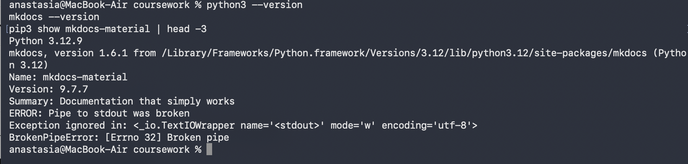

### 2. Структура проекта

Проект создан в папке `coursework` репозитория. Структура получилась такая:

```bash
find . -type f -not -path "./site/*" | sort
```

```
./docs/about.md
./docs/achievements.md
./docs/contacts.md
./docs/images/favicon.png
./docs/images/logo.png
./docs/images/photo.jpg
./docs/index.md
./docs/projects.md
./docs/resume.md
./docs/stylesheets/extra.css
./mkdocs.yml
```

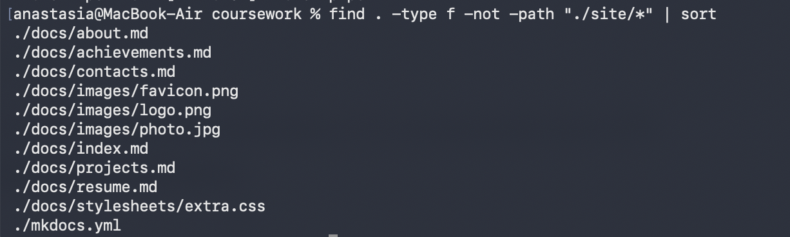

### 3. Настройка конфигурации

Файл `mkdocs.yml` — место, где задаются настройки сайта

**Первая часть: название, тема, навигация.**

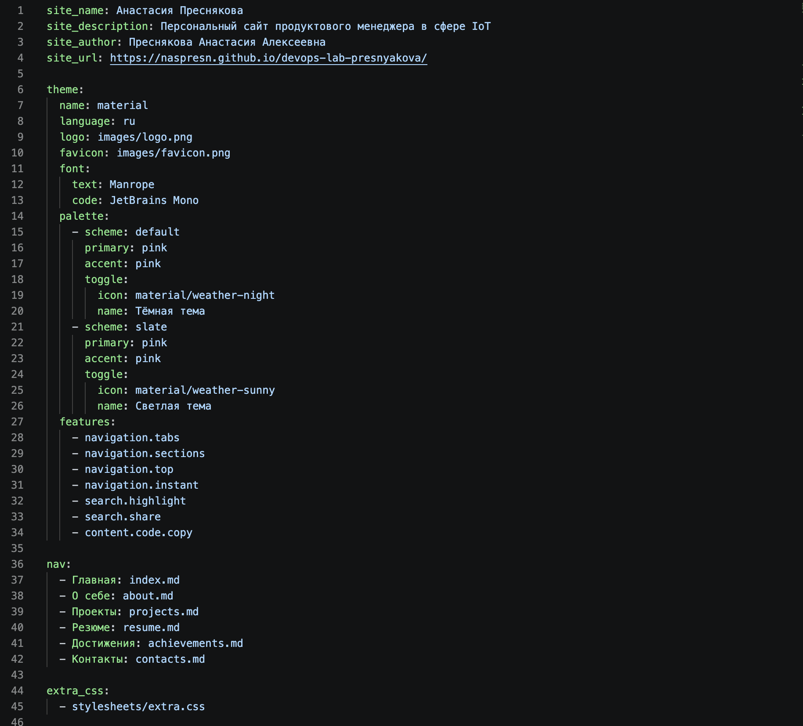

- `site_name`, `site_description`, `site_author`, `site_url` — название сайта, описание для поисковиков, автор и будущий адрес публикации;
- `theme: name: material` — подключение темы, `language: ru` переводит её интерфейс на русский;
- `logo` и `favicon` — свой знак в шапке и значок во вкладке браузера;
- `palette` — две цветовые схемы: светлая `default` и тёмная `slate`, обе с розовым как основным и акцентным цветом. Блок `toggle` создаёт переключатель в шапке;
- `features` — возможности темы: `navigation.tabs` выводит разделы вкладками в шапке, `navigation.top` добавляет кнопку возврата наверх, `search.highlight` подсвечивает найденное;
- `nav` — порядок страниц в меню. Без этого блока MkDocs выстроил бы страницы по алфавиту;
- `extra_css` — подключение собственного файла стилей.

**Вторая часть: расширения Markdown, плагины, футер.**

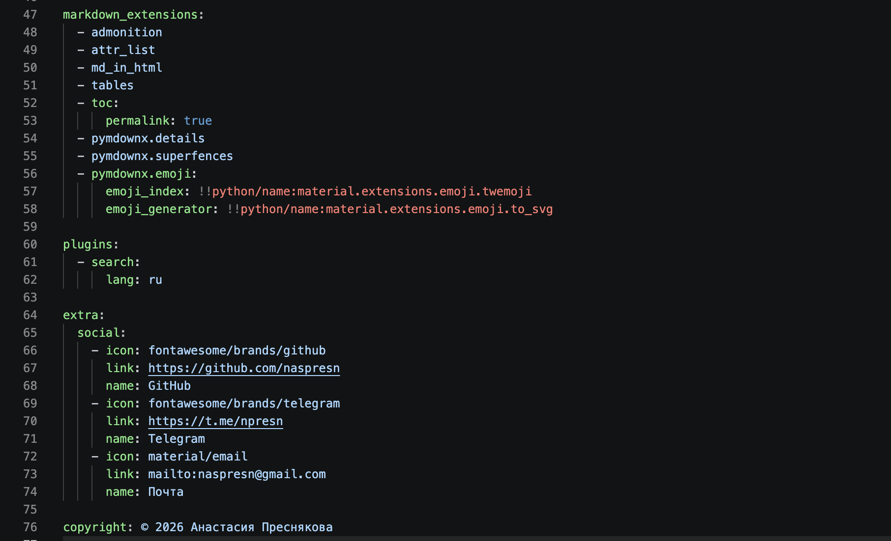

- `markdown_extensions` — дополнительные возможности разметки. `attr_list` и `md_in_html` нужны для карточек, `tables` для таблиц, `admonition` для блоков-подсказок, `pymdownx.emoji` подключает набор иконок Material;
- `plugins: search` с `lang: ru` — поиск по сайту с поддержкой русской морфологии;
- `extra: social` — ссылки на GitHub, Telegram и почту, выводятся иконками в футере;
- `copyright` — строка копирайта внизу каждой страницы.

### 4. Содержание сайта

Сайт состоит из шести страниц.

**Главная.** Шапка с фотографией, именем и коротким рассказом, нумерованный список с направлениями работы, четыре карточки-ссылки на остальные разделы.

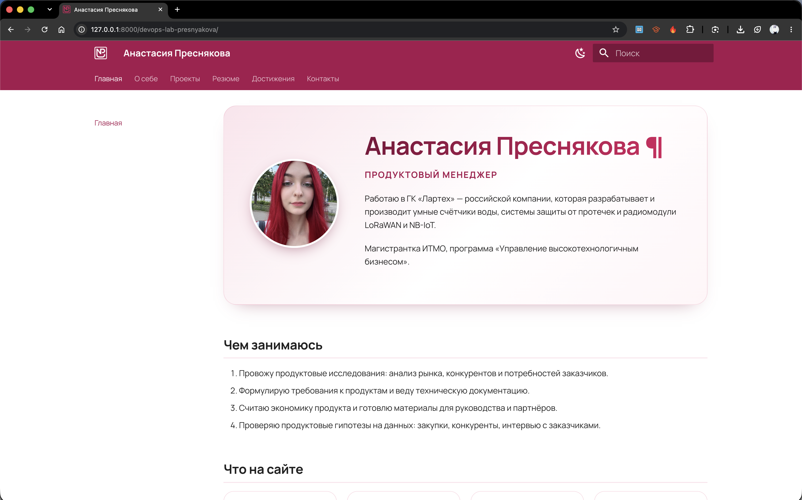

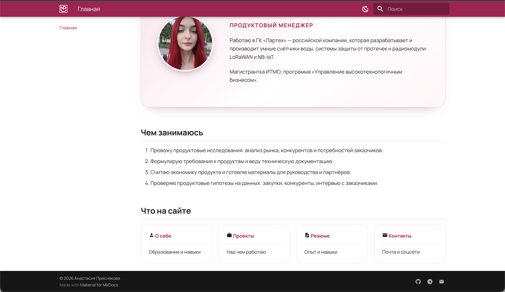

**О себе.** Образование и навыки оформлены таблицами, увлечения маркированным списком.

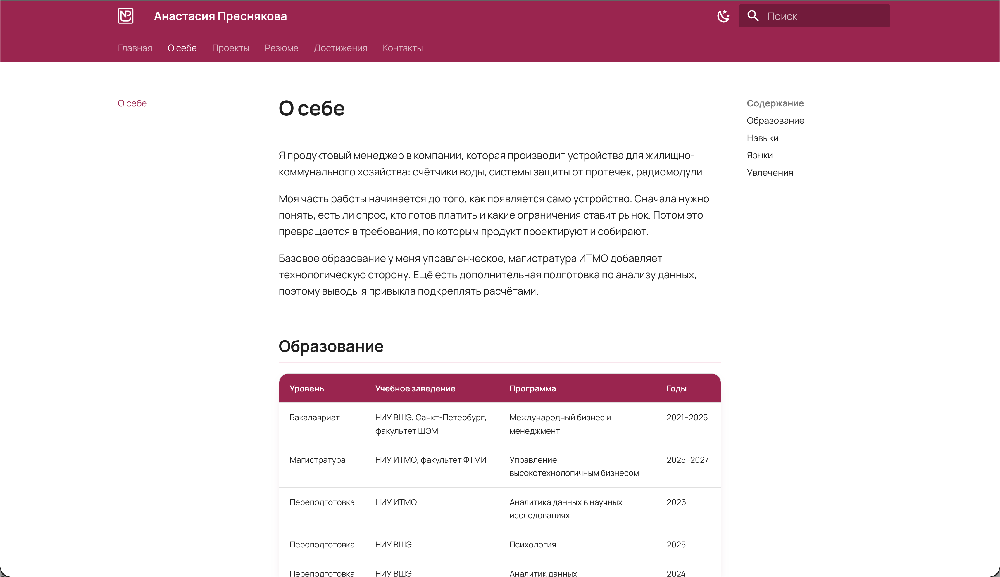

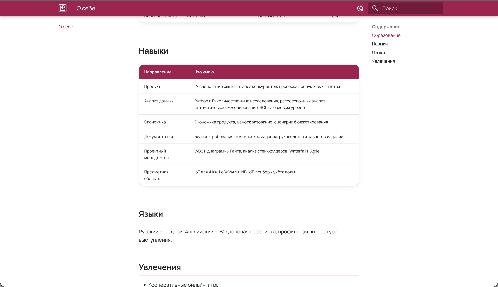

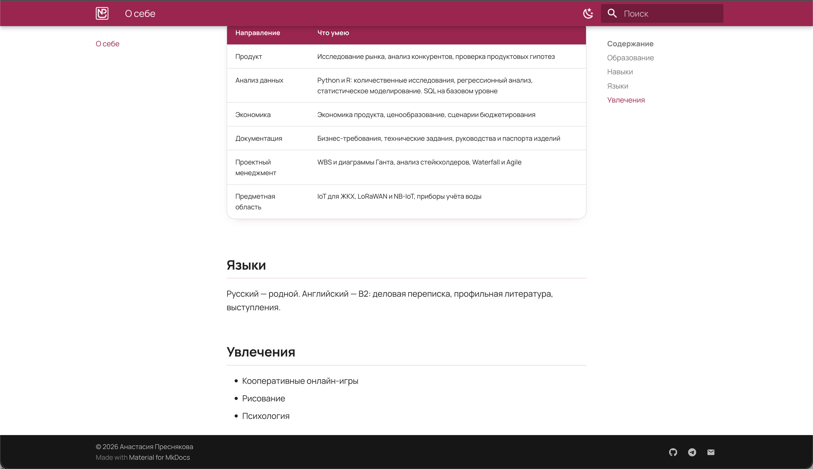

**Проекты.** Два рабочих проекта в виде карточек. У каждого название, описание задачи, что сделано и теги использованных технологий.

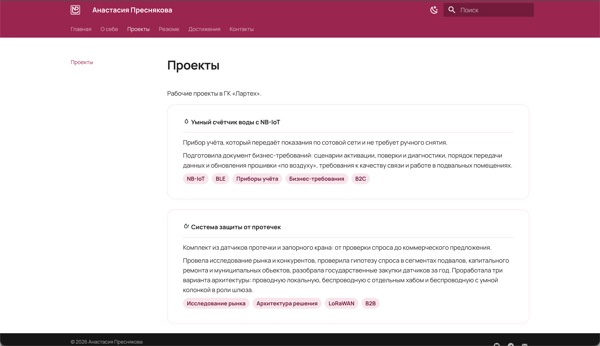

**Резюме.** Опыт работы, образование, навыки по группам, проекты и исследования, языки.

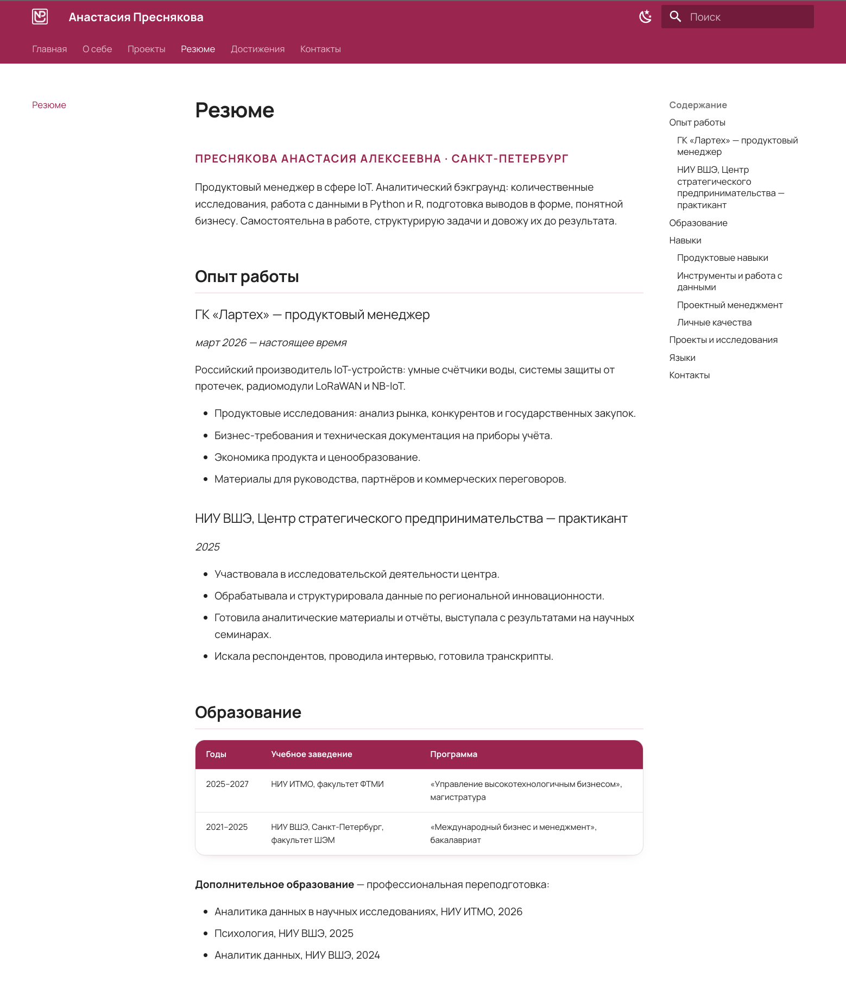

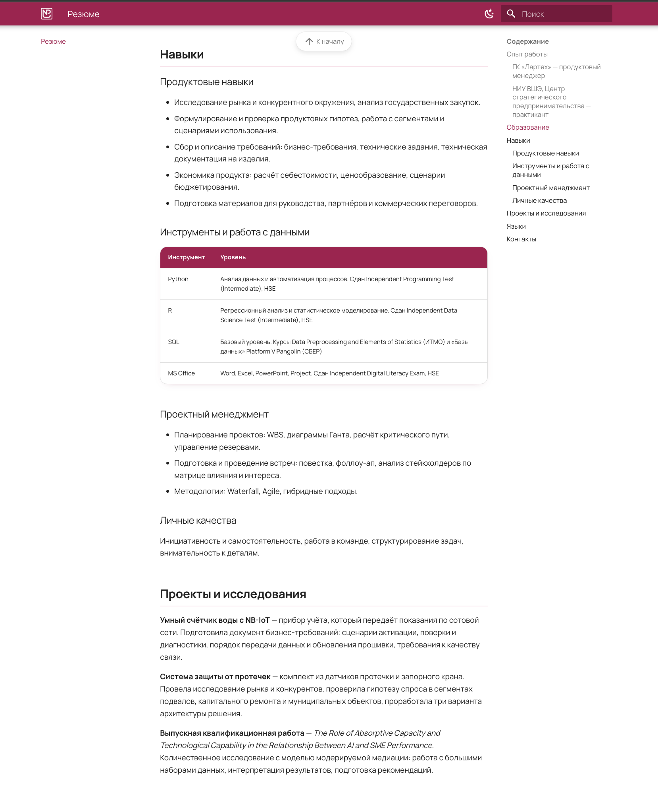

**Достижения.** Два блока: профессиональные и учебные.

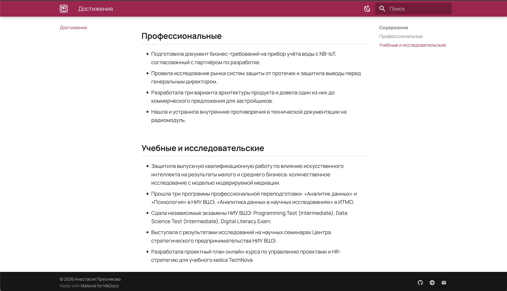

**Контакты.** Таблица со способами связи, в первом столбце иконки почты, Telegram и GitHub. Внизу цитата.

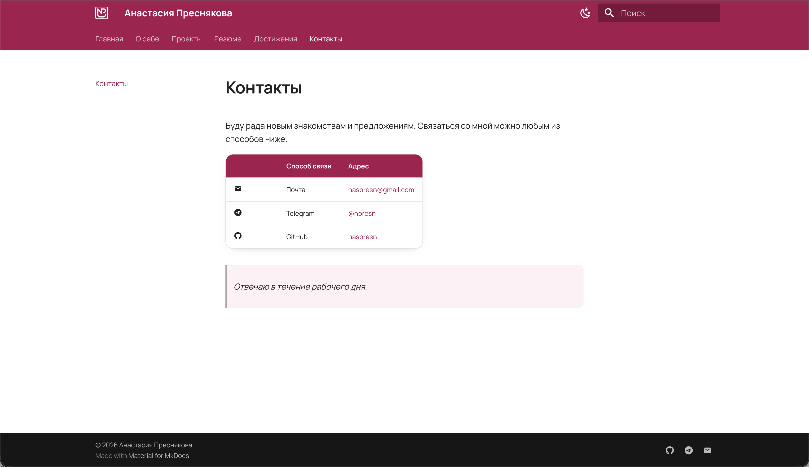

Использованные элементы Markdown: заголовки трёх уровней, нумерованные и маркированные списки, таблицы, ссылки внутренние и внешние, изображения, цитата, выделение полужирным и курсивом, блоки кода, иконки.

### 5. Стилизация

Помимо настроек темы в `mkdocs.yml` написан файл стилей `docs/stylesheets/extra.css`. В нём:

- малиновая палитра, заданная переменными и применённая к обеим цветовым схемам;
- оформление шапки главной страницы: градиентный фон, круглая фотография с обводкой, имя с градиентной заливкой текста;
- карточки: скругления, рамка, подъём и подсветка при наведении курсора;
- теги технологий на странице проектов в виде розовых капсул;
- раскладка карточек: четыре в ряд на главной, одна широкая на странице проектов;
- оформление таблиц, кнопок и цитат;
- правила для узких экранов: на телефоне шапка перестраивается в один столбец.

Тёмная тема включается кнопкой в шапке. Цвета для неё заданы отдельно, чтобы малиновый не был слишком ярким на тёмном фоне.

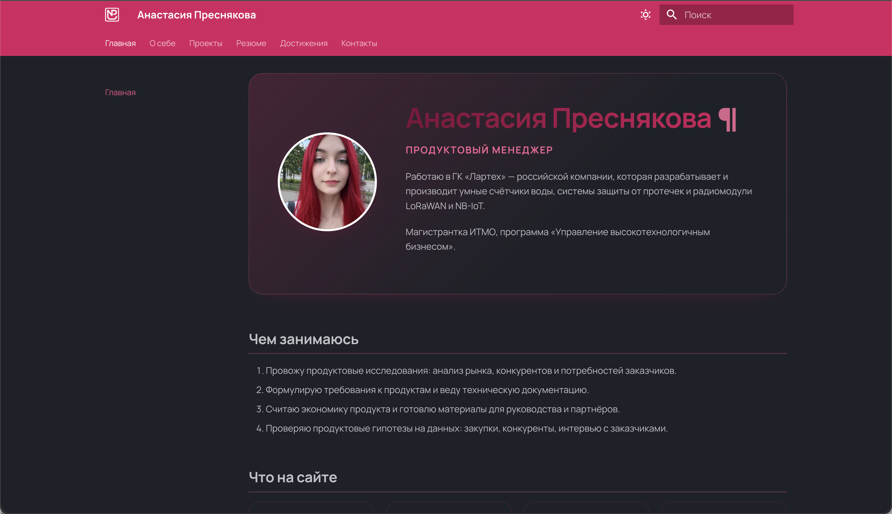

### 6. Тестирование и сборка

**Поиск.** По запросу `nb` найдено 5 совпадений на трёх страницах, найденное подсвечено в результатах.

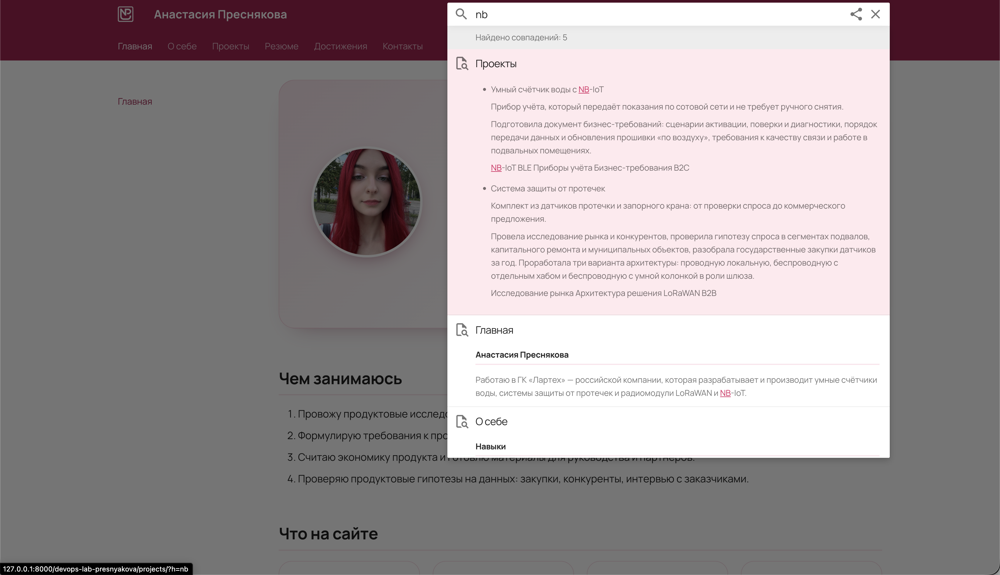

**Локальный сервер.**

```bash
mkdocs serve
```

```
INFO - Building documentation...
INFO - Documentation built in 0.13 seconds
INFO - Watching paths for changes: 'docs', 'mkdocs.yml'
INFO - Serving on http://127.0.0.1:8000/devops-lab-presnyakova/
```

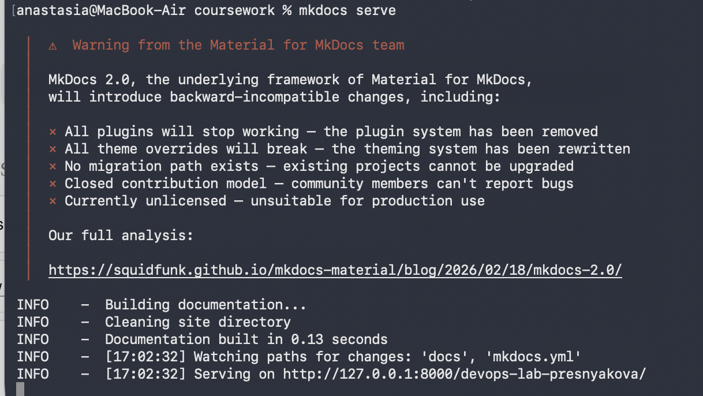

**Сборка статических файлов.**

```bash
mkdocs build
ls -la site/
```

```
INFO - Cleaning site directory
INFO - Building documentation to directory: /Users/anastasia/devops_labs/coursework/site
INFO - Documentation built in 0.14 seconds
```

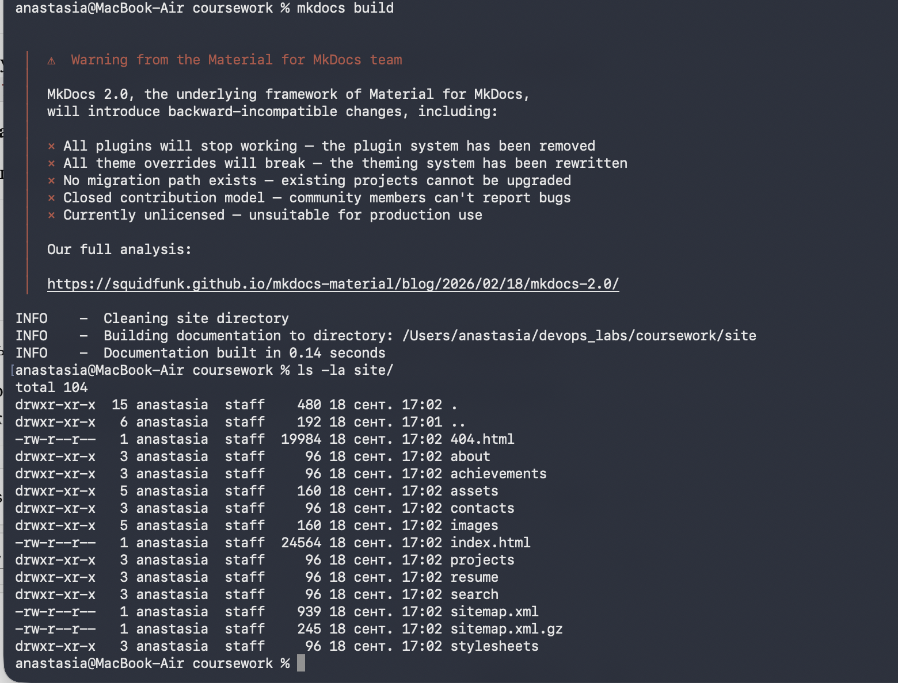


## Выводы

Создан персональный сайт из шести страниц на MkDocs с темой Material. Содержание написано на Markdown, оформление настроено через конфигурацию темы и собственный файл CSS, работа проверена локально и сайт собран в статические файлы.
