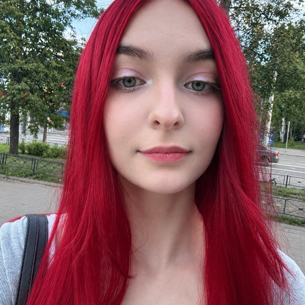

---
hide:
  - toc
---

# Анастасия Преснякова

Продуктовый менеджер

Работаю в ГК «Лартех» — российской компании, которая разрабатывает и производит умные счётчики воды, системы защиты от протечек и радиомодули LoRaWAN и NB-IoT.

Магистрантка ИТМО, программа «Управление высокотехнологичным бизнесом».

## Чем занимаюсь

1. Провожу продуктовые исследования: анализ рынка, конкурентов и потребностей заказчиков.
2. Формулирую требования к продуктам и веду техническую документацию.
3. Считаю экономику продукта и готовлю материалы для руководства и партнёров.
4. Проверяю продуктовые гипотезы на данных: закупки, конкуренты, интервью с заказчиками.

## Что на сайте

-   :material-account: **[О себе](about.md)**

    ---

    Образование и навыки

-   :material-briefcase: **[Проекты](projects.md)**

    ---

    Над чем работаю

-   :material-file-document: **[Резюме](resume.md)**

    ---

    Опыт и навыки

-   :material-email: **[Контакты](contacts.md)**

    ---

    Почта и соцсети

