University: [ITMO University](https://itmo.ru/ru/)
Faculty: [FICT](https://fict.itmo.ru)
Course: [Введение в веб технологии](https://itmo-ict-faculty.github.io/introduction-in-web-tech/)
Year: 2025/2026
Group: U4225
Author: Преснякова Анастасия Алексеевна
Lab: Lab1
Date of create: 07.09.2026
Date of finished: 14.09.2026

# Лабораторная работа №1. Основы работы с Docker

## Цель работы

Освоить базовые операции Docker: установку, получение образов из реестра, запуск и остановку контейнеров, публикацию портов, чтение логов, выполнение команд внутри работающего контейнера и работу с томами.

## Окружение

- macOS, процессор Apple Silicon (архитектура образов — `arm64`)
- Docker Desktop, Docker Engine версии 29.7.2

## Ход работы

### 1. Установка Docker и проверка работоспособности

Docker Desktop установлен с официального сайта. Проверка версии клиента:

```bash
docker --version
```

```
Docker version 29.7.2, build a7dcaa6
```

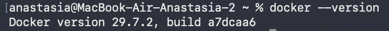

Запуск тестового контейнера:

```bash
docker run hello-world
```

```
Unable to find image 'hello-world:latest' locally
latest: Pulling from library/hello-world
58dee6a49ef1: Pull complete
Digest: sha256:5dd0d3e6e255913fc30f90b9f2b1d359cc2cbdb48090cc4b65f1676e203243cc
Status: Downloaded newer image for hello-world:latest

Hello from Docker!
This message shows that your installation appears to be working correctly.
```

Образа `hello-world` локально не было, поэтому `docker run` сначала выполнил неявный `pull` из Docker Hub, затем создал и запустил контейнер. Образ скачан под платформу `arm64v8` — Docker Hub отдаёт вариант образа под архитектуру хоста.

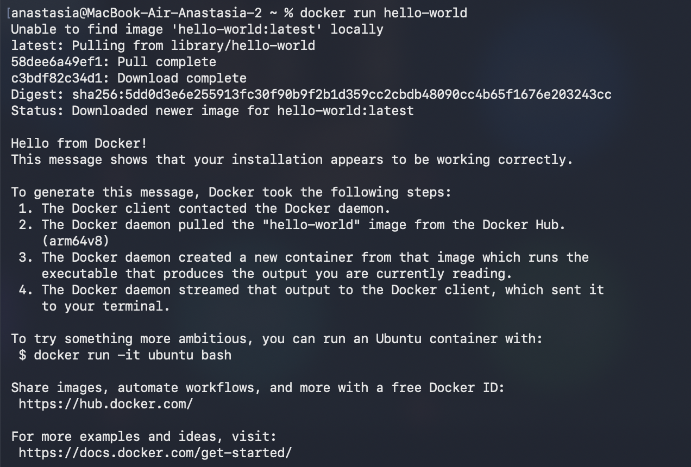

Осмотр локального состояния:

```bash
docker images
```

```
IMAGE                            ID            DISK USAGE   CONTENT SIZE
hello-world:latest               5dd0d3e6e255       22.6kB         10.3kB
jetbrains/youtrack:2026.2.17765  54d25c6f1003        5.3GB           2GB
python:3.12-slim                 57cd7c3a7a27        205MB        45.6MB
```

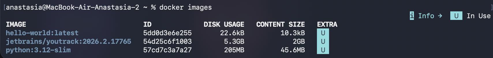

```bash
docker ps
```

Вывод — только заголовок таблицы: работающих контейнеров нет. Контейнер `hello-world` печатает сообщение и сразу завершается, поэтому в `docker ps` он не попадает.

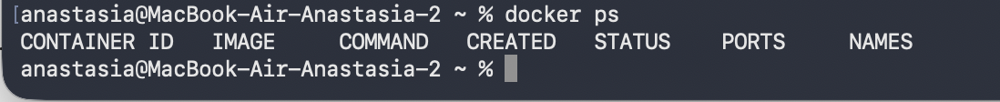

```bash
docker ps -a
```

```
CONTAINER ID   IMAGE                             COMMAND                  STATUS
0c94c8cd60c9   hello-world                       "/hello"                 Exited (0) 4 minutes ago
0a4cf12e959f   python:3.12-slim                  "bash -c 'pip instal…"   Exited (137) 2 minutes ago
11a1ec4d0734   jetbrains/youtrack:2026.2.17765   "/bin/bash /run.sh"      Exited (0) 2 weeks ago
```

`docker ps -a` показывает и завершённые контейнеры. `hello-world` имеет статус `Exited (0)` — завершился успешно, но не удалён: остановленный контейнер сохраняется вместе со своим записываемым слоем, пока его не удалить командой `docker rm`.

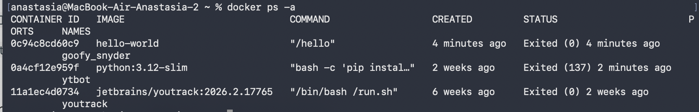

### 2. Работа с готовым образом Ubuntu

```bash
docker pull ubuntu:latest
```

```
latest: Pulling from library/ubuntu
50914c2b24a1: Pull complete
Digest: sha256:2260313b31c8c011cd2eebe728008efac1b3982be73eb71348ea2648d2c0e09b
Status: Downloaded newer image for ubuntu:latest
docker.io/library/ubuntu:latest
```

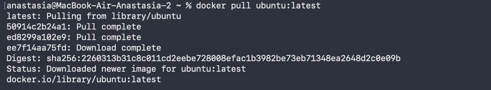

Запуск интерактивного контейнера:

```bash
docker run -it ubuntu bash
```

Флаг `-i` оставляет открытым стандартный ввод контейнера, `-t` выделяет псевдотерминал. Вместе они дают рабочую интерактивную сессию: приглашение сменилось на `root@80a8e5028dc6:/#`, где `80a8e5028dc6` — короткий идентификатор контейнера.

Установка пакета внутри контейнера:

```bash
apt update && apt install -y curl
```

```
Setting up libcurl4t64:arm64 (8.18.0-1ubuntu2.4) ...
Setting up curl (8.18.0-1ubuntu2.4) ...
Processing triggers for libc-bin (2.43-2ubuntu2.3) ...
Processing triggers for ca-certificates (20260601~26.04.1) ...
```

`apt update` требуется отдельным шагом: в базовом образе Ubuntu кэш индексов пакетов удалён, чтобы уменьшить размер образа, поэтому без обновления индексов `apt install` не найдёт пакет. Флаг `-y` подавляет интерактивные подтверждения — внутри контейнера отвечать на них неудобно. Предупреждение `debconf: falling back to frontend: Teletype` в выводе не является ошибкой: в образе нет диалогового фронтенда debconf, и он переключается на текстовый.

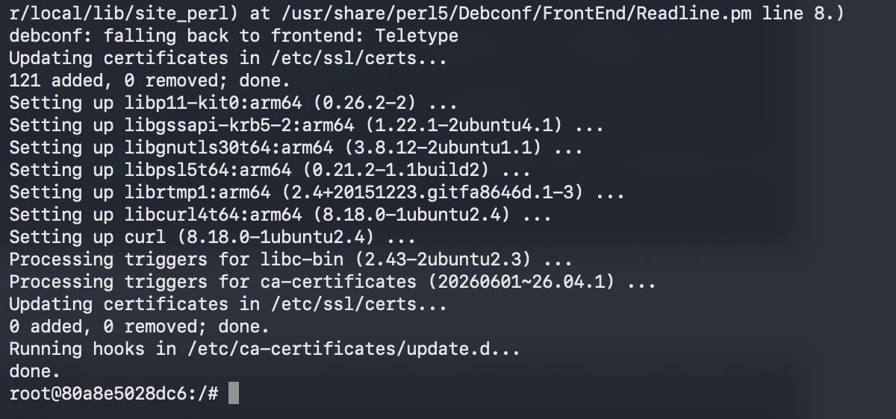

Проверка установки:

```bash
curl --version
```

```
curl 8.18.0 (aarch64-unknown-linux-gnu) libcurl/8.18.0 OpenSSL/3.5.5 zlib/1.3.1 ...
Release-Date: 2026-01-07, security patched: 8.18.0-1ubuntu2.4
```

Строка `aarch64-unknown-linux-gnu` подтверждает, что контейнер работает на архитектуре ARM — той же, что у хоста.

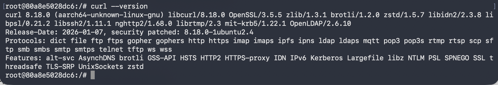

```bash
exit
```

После выхода процесс `bash` — это PID 1 контейнера — завершается, вместе с ним останавливается и сам контейнер (в дальнейшем виден в `docker ps -a` как `ubuntu ... Exited (0)`). Установленный `curl` остался только в записываемом слое этого конкретного контейнера: образ `ubuntu:latest` не изменился, и следующий `docker run -it ubuntu bash` создаст контейнер без `curl`. Чтобы изменения попали в образ, нужен `Dockerfile` с `docker build` (или `docker commit`).

### 3. Запуск веб-сервера nginx

```bash
docker run -d -p 8080:80 --name web-server nginx:alpine
```

```
Unable to find image 'nginx:alpine' locally
alpine: Pulling from library/nginx
...
Status: Downloaded newer image for nginx:alpine
8951a146e1f2b19109fd3543be396734d025cae687715ae190bc8b906ba9447d
```

Разбор флагов:

- `-d` (detached) — контейнер работает в фоне, терминал сразу возвращает управление и печатает полный идентификатор контейнера;
- `-p 8080:80` — порт 80 внутри контейнера публикуется на порт 8080 хоста, поэтому сервер доступен как `localhost:8080`;
- `--name web-server` — постоянное имя вместо случайного (вроде `goofy_snyder` у более раннего контейнера), по которому удобно обращаться в последующих командах;
- тег `alpine` — сборка nginx на базе Alpine Linux, минимальная по размеру.

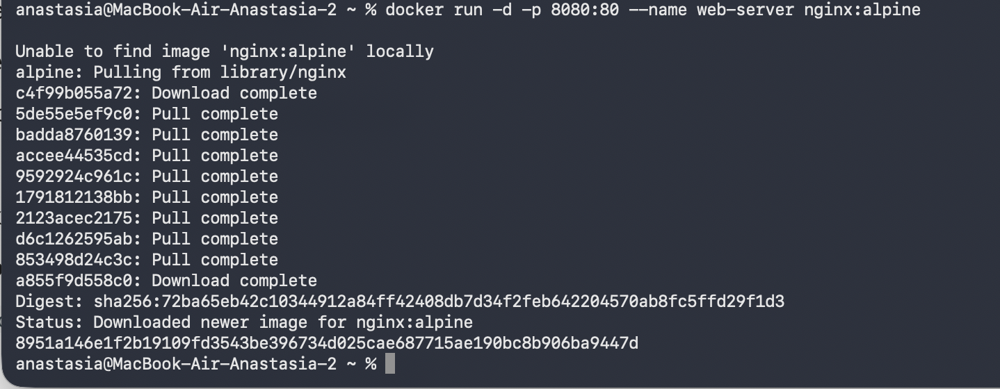

Проверка в браузере по адресу `http://localhost:8080` — отдаётся стандартная страница «Welcome to nginx!».

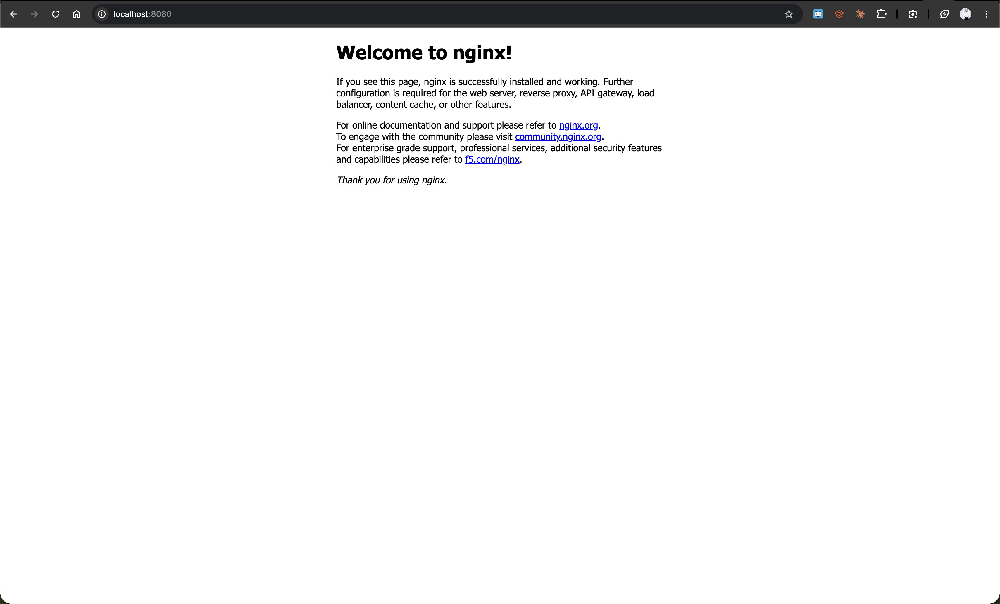

Логи контейнера:

```bash
docker logs web-server
```

```
/docker-entrypoint.sh: Configuration complete; ready for start up
2026/09/07 17:27:53 [notice] 1#1: nginx/1.31.5
2026/09/07 17:27:53 [notice] 1#1: OS: Linux 7.0.12-linuxkit
2026/09/07 17:27:53 [notice] 1#1: start worker processes
192.168.65.1 - - [07/Sep/2026:17:28:08 +0000] "GET / HTTP/1.1" 200 896 "-" "Mozilla/5.0 ... Chrome/152.0.0.0 ..."
192.168.65.1 - - [07/Sep/2026:17:28:08 +0000] "GET /favicon.ico HTTP/1.1" 404 555 ...
```

`docker logs` показывает stdout и stderr главного процесса контейнера. В выводе видны три части: работа entrypoint-скрипта, стартовые сообщения nginx и записи access-лога от запроса из браузера. Запрос `GET /` вернул `200`, а `GET /favicon.ico` — `404`: браузер автоматически запрашивает иконку сайта, которой в стандартном образе нет.

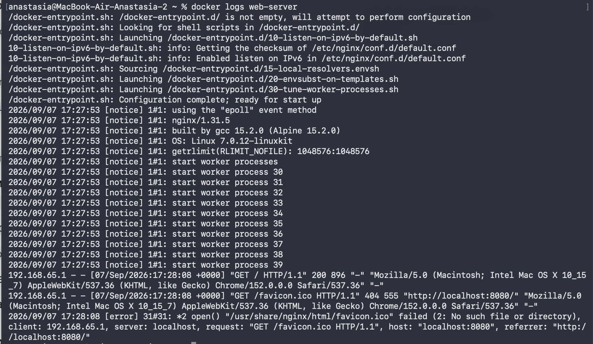

Подключение к работающему контейнеру:

```bash
docker exec -it web-server sh
```

`exec` запускает дополнительный процесс внутри уже работающего контейнера — в отличие от `run`, который создаёт новый контейнер из образа. Используется `sh`, а не `bash`: в Alpine-образах bash не установлен, оболочка по умолчанию — BusyBox `sh`. Приглашение сменилось на `/ #`. Выход из этой сессии командой `exit` контейнер не останавливает, потому что главный процесс (nginx) продолжает работать.

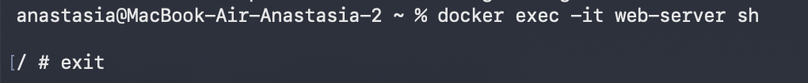

### 4. Управление жизненным циклом контейнеров

```bash
docker ps
```

```
CONTAINER ID   IMAGE          COMMAND                  STATUS         PORTS
8951a146e1f2   nginx:alpine   "/docker-entrypoint.…"   Up 9 minutes   0.0.0.0:8080->80/tcp, [::]:8080->80/tcp
```

Столбец `PORTS` подтверждает проброс порта, а `Up 9 minutes` — что контейнер не остановился после выхода из `exec`-сессии.

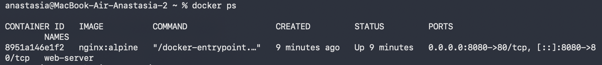

```bash
docker ps -a
```

```
CONTAINER ID   IMAGE          COMMAND                  STATUS
8951a146e1f2   nginx:alpine   "/docker-entrypoint.…"   Up 10 minutes
80a8e5028dc6   ubuntu         "bash"                   Exited (0) 10 minutes ago
0c94c8cd60c9   hello-world    "/hello"                 Exited (0) 22 minutes ago
```

В списке видны все контейнеры работы: работающий nginx и остановленные `ubuntu` (тот, в котором устанавливался curl) и `hello-world`.

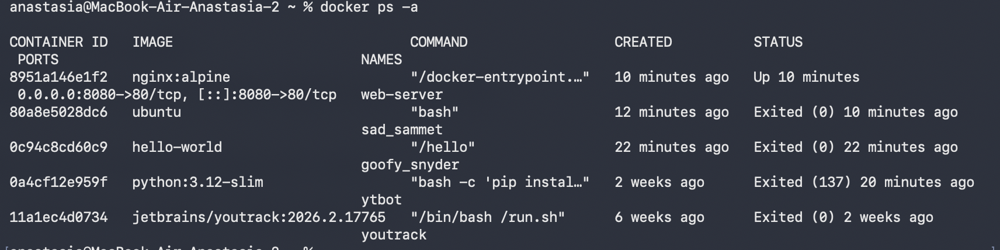

```bash
docker stop web-server
docker start web-server
```

```
web-server
web-server
```

`docker stop` посылает главному процессу сигнал `SIGTERM` и, если процесс не завершился за таймаут (по умолчанию 10 секунд), добивает его `SIGKILL`. `docker start` поднимает тот же самый контейнер — с сохранённой файловой системой и ранее заданными параметрами запуска, поэтому повторно указывать `-p 8080:80` не нужно. В обоих случаях команда печатает имя контейнера как подтверждение.

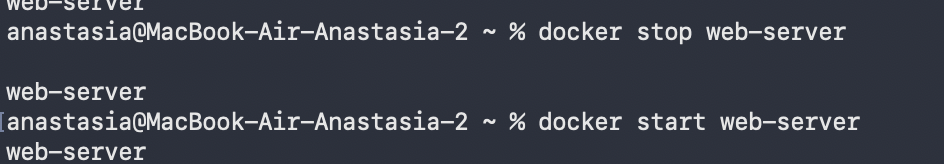

```bash
docker stop web-server
docker rm web-server
```

```
web-server
```

`docker rm` удаляет контейнер вместе с его записываемым слоем. Работающий контейнер удалить нельзя — требуется предварительный `stop` либо флаг `-f`.

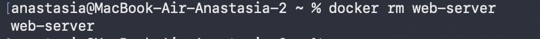

```bash
docker rmi nginx:alpine
```

```
Untagged: nginx:alpine
Deleted: sha256:72ba65eb42c10344912a84ff42408db7d34f2feb642204570ab8fc5ffd29f1d3
```

Две строки вывода отражают два разных действия: `Untagged` — снятие тега `nginx:alpine` с образа, `Deleted` — фактическое удаление слоёв, которое происходит только после того, как на образ не осталось ни ссылок по тегу, ни контейнеров. Поэтому порядок удаления обязателен: сначала контейнер, затем образ — при существующем контейнере (даже остановленном) `docker rmi` завершился бы ошибкой.

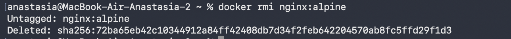

### 5. Работа с томами

```bash
docker volume create my-volume
docker run -it --name volume-test -d -v my-volume:/data ubuntu bash
```

```
my-volume
7aa1ab63ac53a6552770e8a51c0489c55cd954d1fc1aa7b6509c164e931893d5
```

Том — это хранилище, которым управляет сам Docker; оно расположено вне слоёв образа и вне записываемого слоя контейнера. Параметр `-v my-volume:/data` монтирует том в каталог `/data` внутри контейнера, поэтому содержимое `/data` живёт независимо от времени жизни контейнера.

Комбинация `-it` вместе с `-d` нужна здесь для того, чтобы `bash` не завершился сразу: в фоне у контейнера нет присоединённого терминала, и без `-it` процесс `bash` завершился бы мгновенно, остановив контейнер. С `-it` контейнер остаётся в состоянии `Up`, и к нему можно подключаться через `exec`.

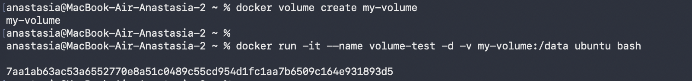

```bash
docker exec -it volume-test bash
echo "Hello from volume" > /data/test.txt
exit
```

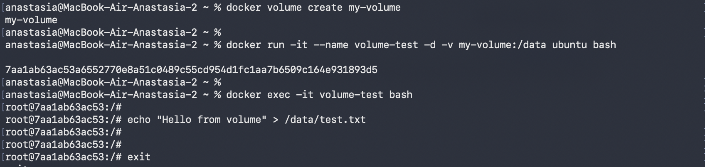

Удаление контейнера:

```bash
docker stop volume-test
docker rm volume-test
docker ps -a
```

В выводе `docker ps -a` контейнера `volume-test` больше нет — он удалён вместе со своим записываемым слоем. Том `my-volume` при этом не удаляется: `docker rm` не затрагивает именованные тома.

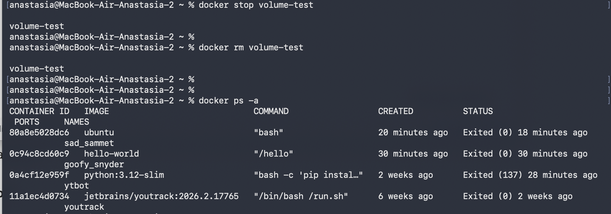

Создание нового контейнера с тем же томом:

```bash
docker run -it --name volume-test -d -v my-volume:/data ubuntu bash
```

```
29a0201146a0eb89dc052bd73314b705ee34046daeb9543ff3aa31ef8315f32e
```

Идентификатор новый (`29a0201146a0`) — это другой контейнер, а не восстановленный прежний.

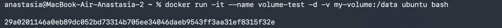

```bash
docker ps
```

```
CONTAINER ID   IMAGE    COMMAND   CREATED          STATUS         NAMES
29a0201146a0   ubuntu   "bash"    23 seconds ago   Up 22 seconds  volume-test
```

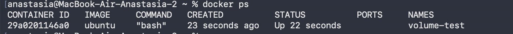

Проверка сохранности данных:

```bash
docker exec -it volume-test cat /data/test.txt
```

```
Hello from volume
```

Файл доступен в новом контейнере, хотя контейнер, в котором он создавался, удалён. Это и есть назначение тома: записываемый слой контейнера исчезает вместе с контейнером, а том сохраняется.

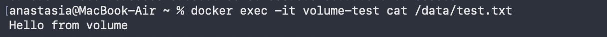

Завершающая уборка:

```bash
docker stop volume-test
docker rm volume-test
```

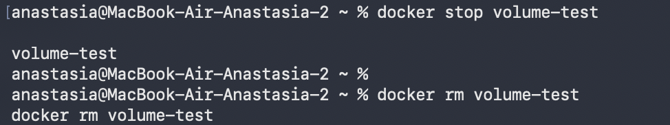

Сам том остаётся в системе и при необходимости удаляется отдельно:

```bash
docker volume ls
docker volume rm my-volume
```

## Контрольные вопросы

**Чем Docker-образ отличается от Docker-контейнера?**

Образ — неизменяемый шаблон, набор слоёв файловой системы плюс метаданные о том, какой процесс запускать. Контейнер — работающий экземпляр образа с дополнительным записываемым слоем поверх. Из одного образа можно создать много контейнеров; изменения внутри контейнера в образ не попадают. Это наблюдалось в работе: `curl`, установленный в контейнере из `ubuntu:latest`, остался только в слое этого контейнера, а сам образ не изменился.

**Что происходит при выполнении `docker run`?**

`docker run` последовательно делает несколько операций: клиент передаёт запрос демону Docker; если нужного образа нет локально, демон скачивает его из реестра (в работе это видно по строке `Unable to find image ... locally` и последующему `Pulling from library/...`); затем демон создаёт новый контейнер — записываемый слой, сетевые настройки, проброс портов, монтирование томов — и запускает в нём указанную команду как PID 1. С флагом `-d` управление сразу возвращается в терминал и печатается идентификатор контейнера; без него stdout/stderr процесса транслируются в терминал. Жизнь контейнера равна жизни его PID 1: когда процесс завершается, контейнер переходит в состояние `Exited`, но не удаляется.

## Выводы

В работе освоены базовые операции Docker: установка и проверка, загрузка образов из Docker Hub, запуск контейнеров в интерактивном и фоновом режимах, публикация портов, чтение логов, выполнение команд внутри работающего контейнера, управление жизненным циклом и работа с томами.

Практически зафиксированы четыре ключевых момента:

- образ неизменяем, а изменения контейнера живут в его записываемом слое и теряются вместе с контейнером;
- `run` создаёт новый контейнер, `exec` запускает процесс в существующем;
- жизненный цикл контейнера привязан к его главному процессу, поэтому `hello-world` и `ubuntu bash` завершаются сразу, а фоновый nginx продолжает работать;
- том решает проблему сохранности данных: файл, записанный в смонтированный том, доступен после удаления контейнера и создания нового.
