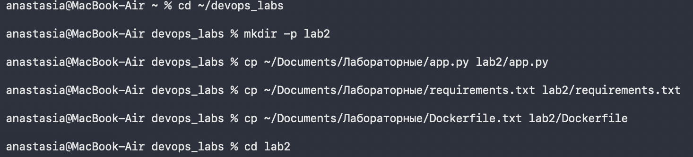
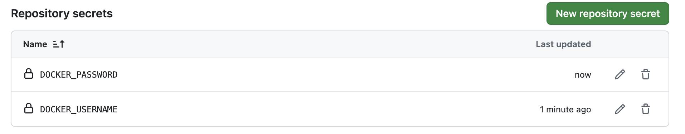
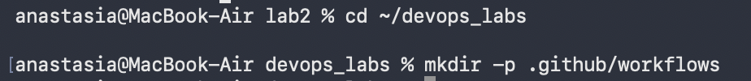
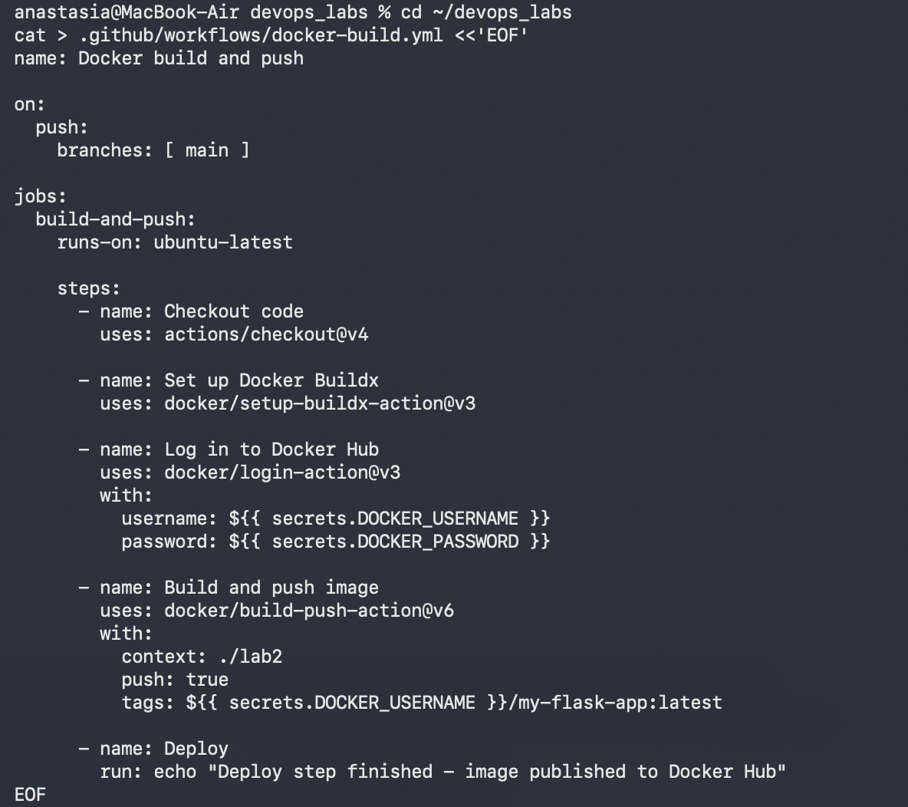
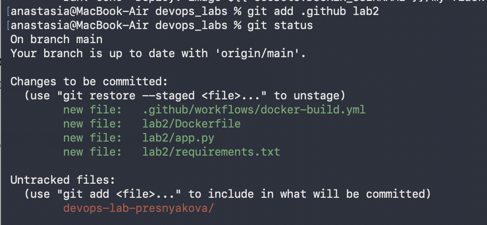
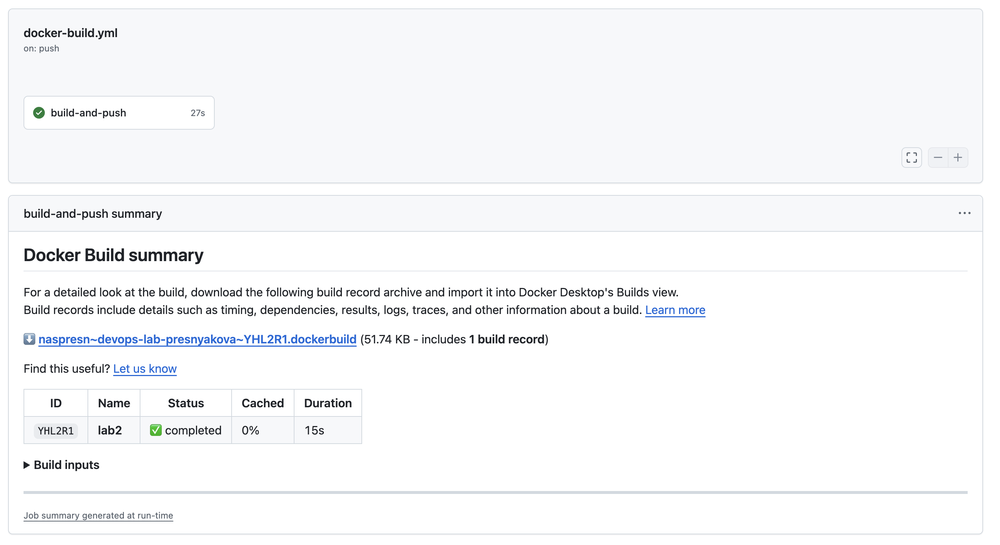
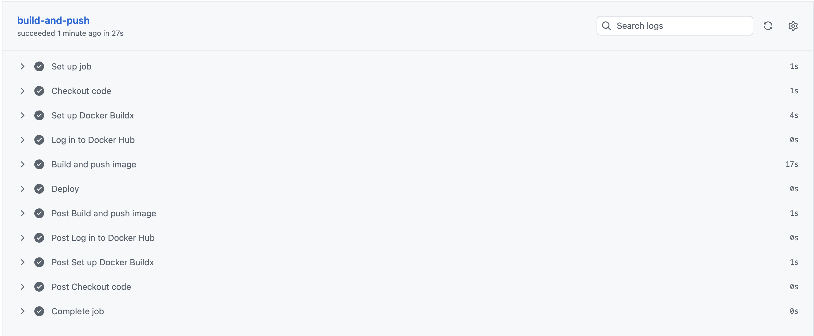
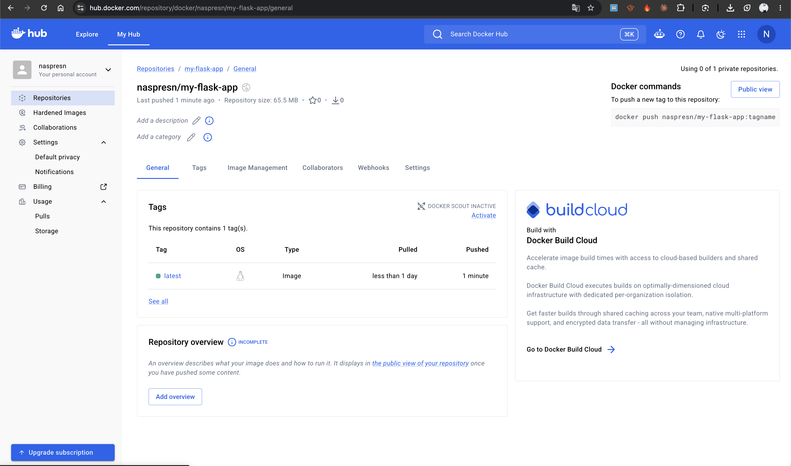

University: [ITMO University](https://itmo.ru/ru/)
Faculty: [FICT](https://fict.itmo.ru)
Course: [Введение в веб технологии](https://itmo-ict-faculty.github.io/introduction-in-web-tech/)
Year: 2026/2027
Group: U4225
Author: Преснякова Анастасия Алексеевна
Lab: Lab2
Date of create: 13.09.2026
Date of finished: 14.09.2026

# Лабораторная работа №2. CI/CD для Docker приложения

## Цель работы

Научиться настраивать автоматизированный пайплайн, который при изменении кода сам собирает Docker-образ, публикует его в registry и выполняет шаг деплоя.

## Ход работы

### 1. Подготовка проекта

Файлы приложения из первой лабораторной работы (`app.py`, `requirements.txt` и `Dockerfile`) скопированы в папку `lab2` репозитория:

```bash
cd ~/devops_labs
mkdir -p lab2
cp ~/Documents/Лабораторные/app.py lab2/app.py
cp ~/Documents/Лабораторные/requirements.txt lab2/requirements.txt
cp ~/Documents/Лабораторные/Dockerfile.txt lab2/Dockerfile
```



На Docker Hub создан аккаунт `naspresn` и репозиторий `my-flask-app` для будущего образа, а также токен доступа с правами на чтение и запись.

### 2. Настройка секретов в GitHub

В настройках репозитория (Settings → Secrets and variables → Actions) созданы два секрета:

- `DOCKER_USERNAME`
- `DOCKER_PASSWORD`




### 3. Настройка GitHub Actions

Создана папка для пайплайнов:

```bash
cd ~/devops_labs
mkdir -p .github/workflows
```



В папке создан файл `docker-build.yml`:

```yaml
name: Docker build and push

on:
  push:
    branches: [ main ]

jobs:
  build-and-push:
    runs-on: ubuntu-latest

    steps:
      - name: Checkout code
        uses: actions/checkout@v4

      - name: Set up Docker Buildx
        uses: docker/setup-buildx-action@v3

      - name: Log in to Docker Hub
        uses: docker/login-action@v3
        with:
          username: ${{ secrets.DOCKER_USERNAME }}
          password: ${{ secrets.DOCKER_PASSWORD }}

      - name: Build and push image
        uses: docker/build-push-action@v6
        with:
          context: ./lab2
          push: true
          tags: ${{ secrets.DOCKER_USERNAME }}/my-flask-app:latest

      - name: Deploy
        run: echo "Deploy step finished - image published to Docker Hub"
```



### 5. Тестирование пайплайна

Перед отправкой проверено, какие файлы попадут в коммит:

```bash
git add .github lab2
git status
```



```bash
git commit -m "Add lab2: Flask app and GitHub Actions CI/CD pipeline"
git push
```

Сразу после отправки GitHub запустил пайплайн. Задача `build-and-push` завершилась успешно за 27 секунд, сборка образа заняла 15 секунд.



Все шаги отработали без ошибок:




Образ появился в Docker Hub: репозиторий `naspresn/my-flask-app`.




## Выводы

В ходе работы настроен пайплайн непрерывной сборки и публикации Docker образа в Docker Hub, а также настроены секреты для безопасной работы с registry.