University: [ITMO University](https://itmo.ru/ru/)
Faculty: [FICT](https://fict.itmo.ru)
Course: [Введение в веб технологии](https://itmo-ict-faculty.github.io/introduction-in-web-tech/)
Year: 2026/2027
Group: U4225
Author: Преснякова Анастасия Алексеевна
Lab: Lab3
Date of create: 13.09.2026
Date of finished: 14.09.2026

# Лабораторная работа №3. Мониторинг с Prometheus и Grafana

## Цель работы

Настроить локальную систему мониторинга: собирать метрики машины с помощью Prometheus и выводить их на графики в Grafana.

## Ход работы

### 1. Конфигурация Prometheus

```bash
cd ~/devops_labs
mkdir -p lab3/prometheus
cd lab3
cat > prometheus/prometheus.yml <<'EOF'
global:
  scrape_interval: 15s

scrape_configs:
  - job_name: 'prometheus'
    static_configs:
      - targets: ['localhost:9090']

  - job_name: 'node-exporter'
    static_configs:
      - targets: ['node-exporter:9100']
EOF
```

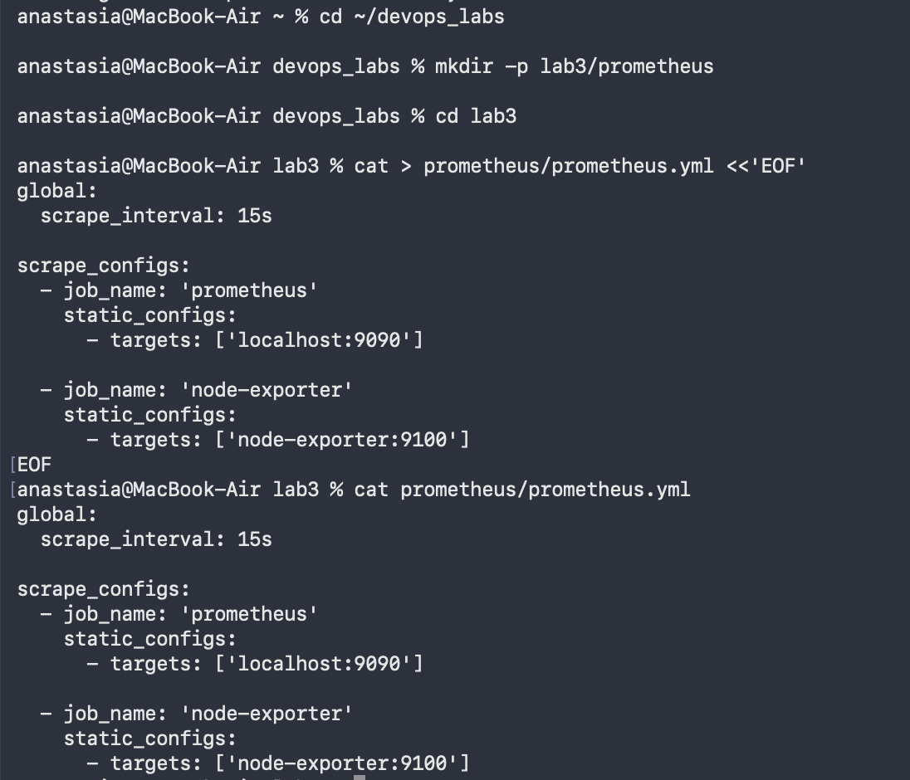

### 2. Сеть и тома

```bash
docker network create monitoring
docker volume create prometheus-data
docker volume create grafana-data
```

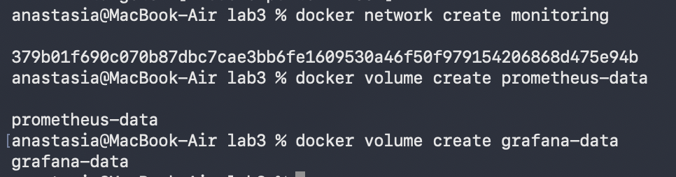

### 3. Node Exporter

```bash
docker run -d \
  --name node-exporter \
  --network monitoring \
  --restart=unless-stopped \
  -p 9100:9100 \
  -v "/proc:/host/proc:ro" \
  -v "/sys:/host/sys:ro" \
  -v "/:/rootfs:ro" \
  prom/node-exporter \
  --path.procfs=/host/proc \
  --path.rootfs=/rootfs \
  --path.sysfs=/host/sys \
  --collector.filesystem.mount-points-exclude='^/(sys|proc|dev|host|etc)($|/)'
```

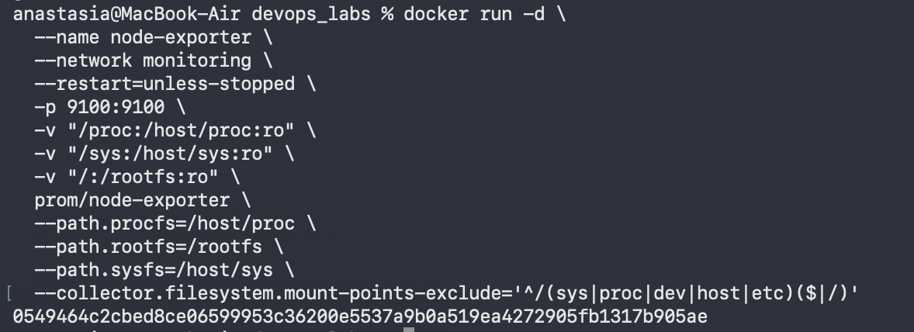

Проверка:

```bash
docker ps | grep node-exporter
curl -s http://localhost:9100/metrics | head -20
```

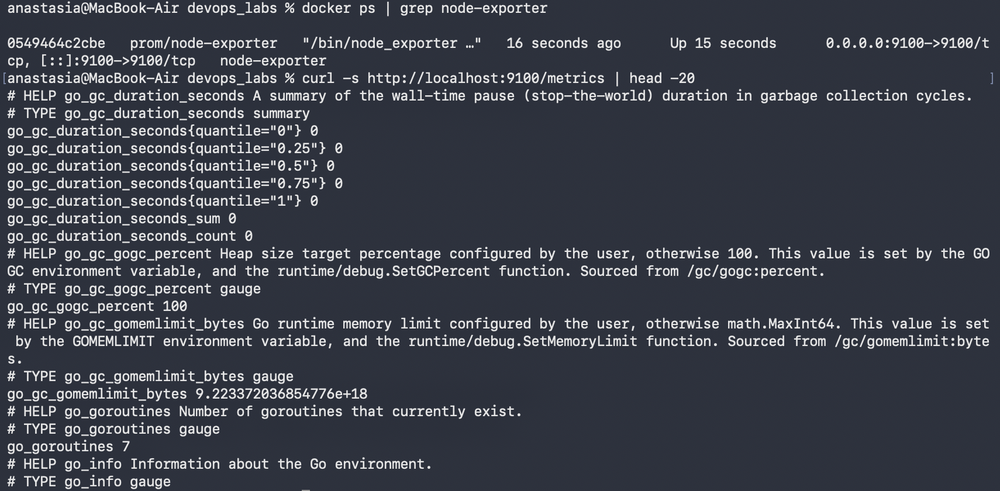

### 4. Prometheus

```bash
docker run -d \
  --name prometheus \
  --network monitoring \
  --restart=unless-stopped \
  -p 9090:9090 \
  -v prometheus-data:/prometheus \
  -v $(pwd)/prometheus:/etc/prometheus \
  prom/prometheus \
  --config.file=/etc/prometheus/prometheus.yml \
  --storage.tsdb.path=/prometheus \
  --storage.tsdb.retention.time=200h \
  --web.enable-lifecycle
```

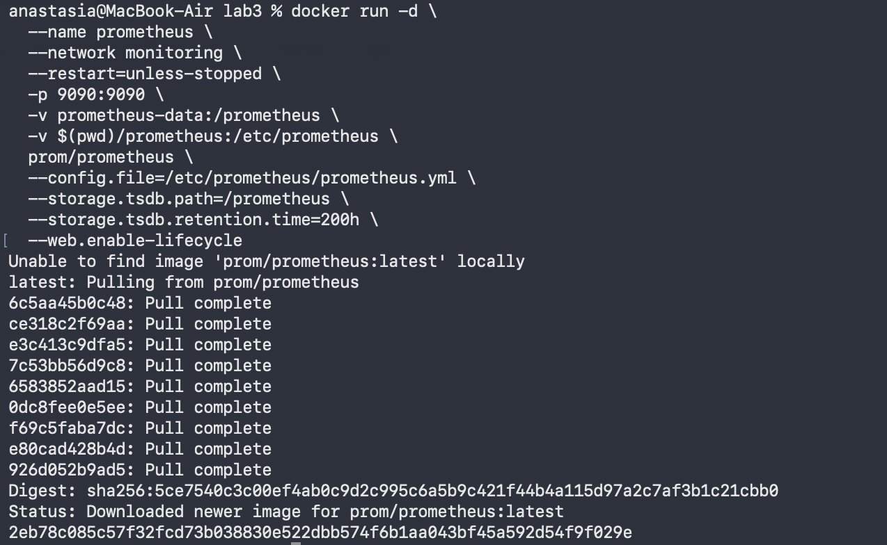

Веб-интерфейс на `http://localhost:9090` открывается на странице запросов:


Обе цели, `prometheus` и `node-exporter`, в состоянии UP.

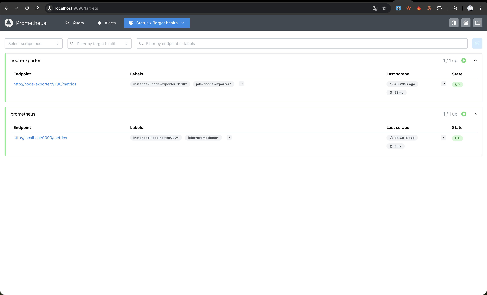

### 5. Grafana

```bash
docker run -d \
  --name grafana \
  --network monitoring \
  --restart=unless-stopped \
  -p 3000:3000 \
  -v grafana-data:/var/lib/grafana \
  -e "GF_SECURITY_ADMIN_PASSWORD=admin" \
  grafana/grafana
```

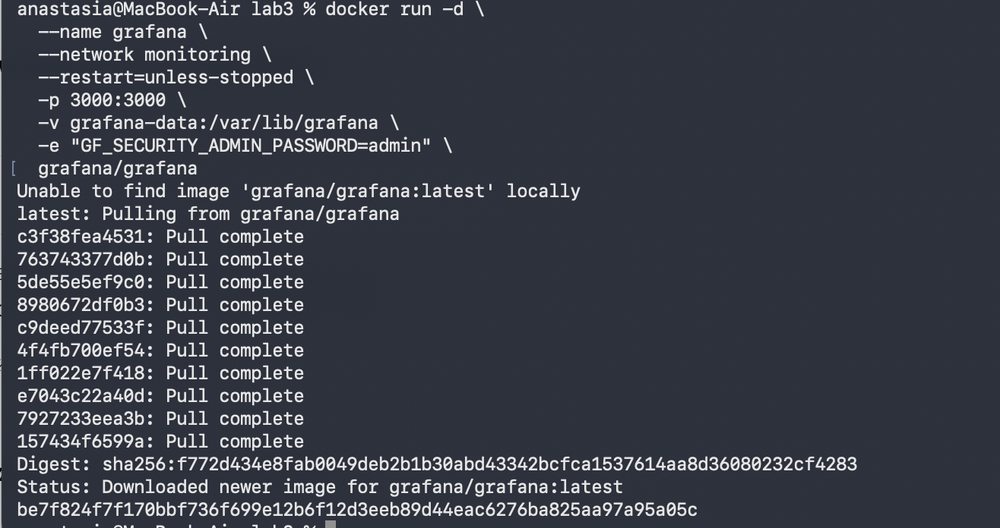

Вход на `http://localhost:3000`

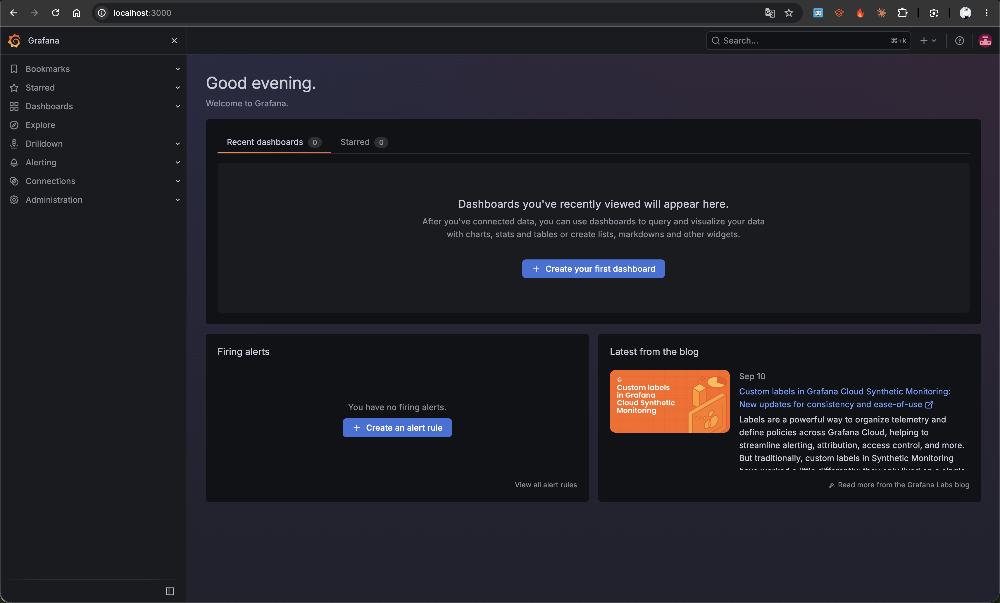

### 6. Источник данных

В разделе **Connections → Data sources** добавлен источник типа Prometheus с адресом:

```
http://prometheus:9090
```

### 7. Дашборд

Создан дашборд `Lab3 Dashboard`. Первый график построен по метрике:

```
node_cpu_seconds_total
```

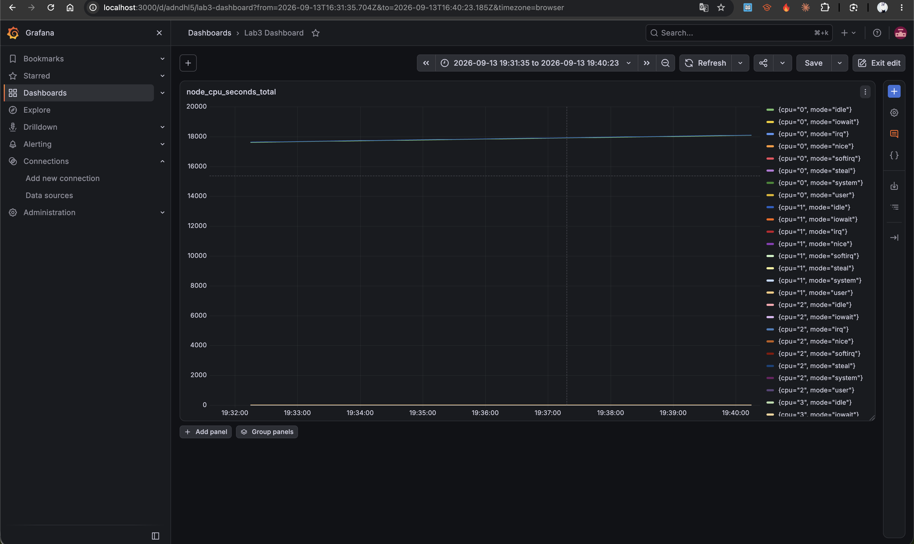

Добавлены ещё два графика по памяти и по диску:

```
node_memory_MemAvailable_bytes
node_filesystem_avail_bytes
```

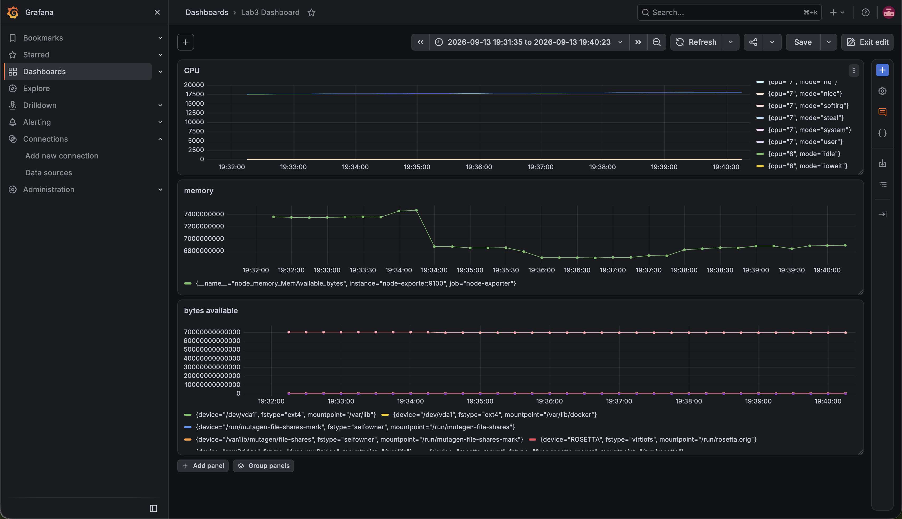

### 8. Проверка системы

```bash
docker ps
```

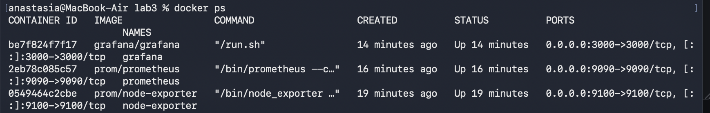


## Выводы

Собрана связка из трёх контейнеров: Node Exporter измеряет показатели машины, Prometheus раз в 15 секунд забирает их и хранит, Grafana строит по ним графики.